# SymFold 模型架构演进详解

> 从 v1 到 v4，一个 RNA 二级结构预测模型的成长之路。

---

## 零、你在预测什么？

先理解任务本质：给定一条 RNA 序列（如 `AUGCGCAU`），预测哪些碱基会"配对"形成空间结构。

输出是一个 **L×L 的对称二值矩阵**（Contact Map），其中 `C[i,j]=1` 表示第 i 和第 j 个碱基配对：

```
RNA:  A U G C G C A U
      1 2 3 4 5 6 7 8

配对: (1,8) (2,7) (3,6)

Contact Map:
    1 2 3 4 5 6 7 8
1 [ . . . . . . . 1 ]    ← A 和 U(8) 配对
2 [ . . . . . . 1 . ]    ← U 和 A(7) 配对
3 [ . . . . . 1 . . ]    ← G 和 C(6) 配对
4 [ . . . . . . . . ]
5 [ . . . . . . . . ]
6 [ . . 1 . . . . . ]    ← 对称
7 [ . 1 . . . . . . ]
8 [ 1 . . . . . . . ]
```

**关键物理约束**：
- **对称**: `C[i,j] = C[j,i]`
- **每行至多一个1**: 每个碱基最多和一个 partner 配对
- **Stem 结构**: 配对总是"成堆"出现，形成反对角线模式
- **极度稀疏**: 只有约 0.5% 的位置为1

---

## 一、核心思路：为什么用"生成模型"做结构预测？

SymFold 的核心创新在于：**不直接预测结构，而是把结构预测建模为"从噪声逐步生成"的过程**。


这种方式的好处：
1. **不确定性建模** — 一条 RNA 可能有多个亚稳态结构，生成模型天然支持
2. **全局一致性** — 逐步"长出"结构，而非独立预测每个像素
3. **灵活引导** — 可以在采样过程中注入物理约束

---

## 二、版本演进总览

```mermaid
timeline
    title SymFold 架构演进
    section v1 (Baseline)
      : SE-DiT + Bernoulli Flow
      : 6层, hidden=192
      : 单层 RNA-FM
      : F1 ≈ 0.56
    section v2 (探索)
      : 尝试 Row-Softmax
      : 尝试 U-Net 下采样
      : ❌ 失败，回退
    section v3 (重构)
      : PA-DiT 设计
      : Triangle Update
      : 物理约束思考
      : 设计文档阶段
    section v4 (当前)
      : DA-SE-DiT-v4
      : 9层, hidden=256
      : Multi-Layer FM Fusion
      : Triangle Update (后3层)
      : Adaptive Density Loss
      : SwiGLU + RoPE
      : F1 ≈ 0.70+
```

---

## 三、V4 完整架构图

这是当前的主力模型。下面我从"上帝视角"到"显微镜视角"逐层拆解：

### 3.1 顶层架构

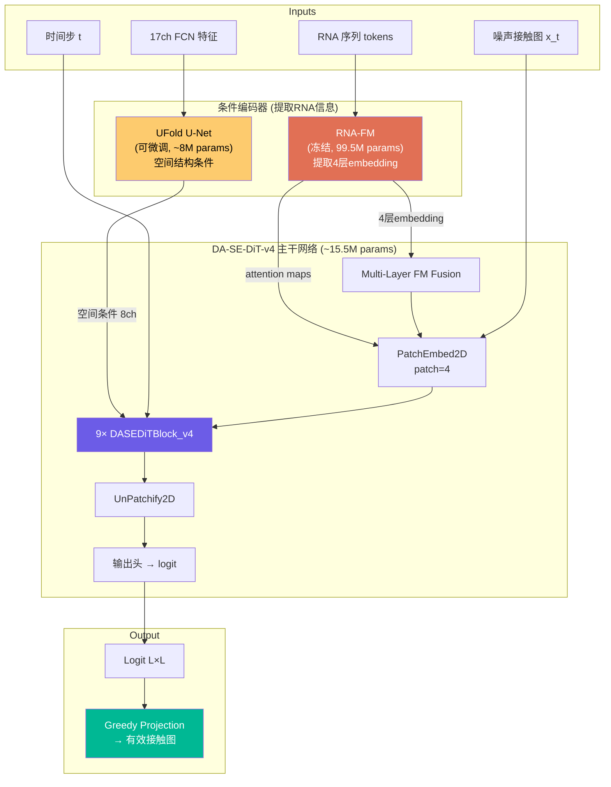

### 3.2 参数量分布

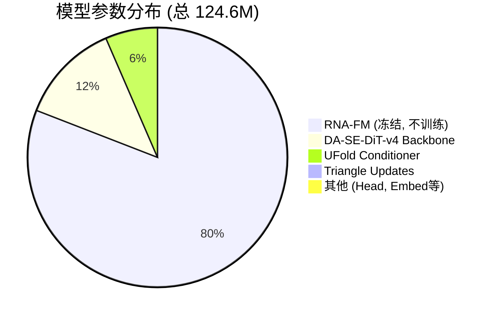

> 实际可训练参数约 **25.1M**，RNA-FM 完全冻结不更新。

---

## 四、关键 Block 详解

### 4.1 条件编码器：RNA-FM

**作用**：从 RNA 序列中提取丰富的语义特征。这是一个预训练的 RNA 语言模型（类似 NLP 中的 BERT），已经学会了 RNA 的"语法"。

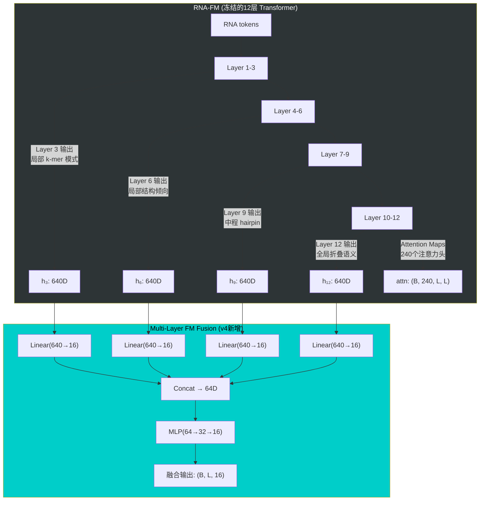

**为什么提取4层而不是只用最后一层？**
- 浅层 (Layer 3): 捕获局部碱基组合模式（类似 k-mer）
- 中层 (Layer 6): 发现局部结构倾向（stem seed）
- 深层 (Layer 9): 理解中程依赖（hairpin loop）
- 最深 (Layer 12): 全局折叠语义

v1 只用最后一层，v4 改为多层融合 + 可学习权重，效果显著提升。

---

### 4.2 条件编码器：UFold U-Net

**作用**：从物理化学特征中提取空间结构信息。

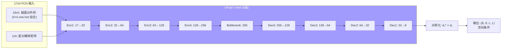

**对称化操作** `d1.T * d1` 确保 UFold 的输出也满足对称性。

---

### 4.3 核心：DASEDiTBlock_v4

这是模型最核心的重复单元，共堆叠 **9 层**。每一层做的事：

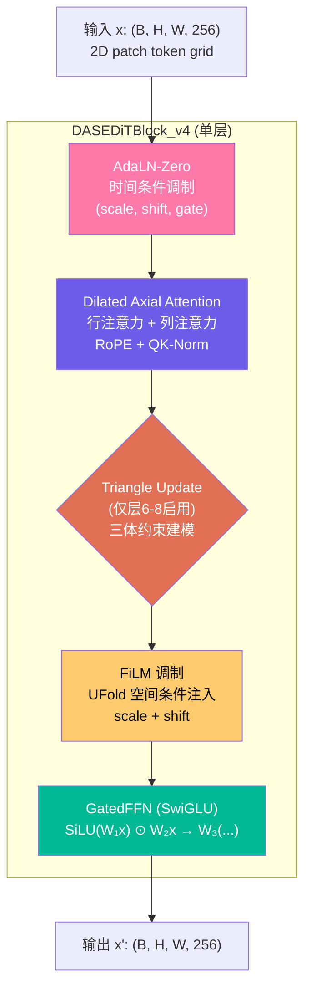

下面逐一讲解每个子模块：

---

#### 4.3.1 AdaLN-Zero（时间条件调制）

**作用**：告诉模型"现在是去噪的第几步"。不同时间步，模型应该有不同行为：
- 早期 (t≈0)：输入几乎全是噪声，模型需要"大胆猜"大结构
- 后期 (t≈1)：输入已经很接近真实结构，模型需要"精细调"

```
输入: x, time_embedding
────────────────────────────
scale, shift, gate = MLP(time_embed)   # 6个调制参数
x = LayerNorm(x)
x = x * (1 + scale) + shift           # 调制
x = Attention(x)
x = x * gate                          # 门控（初始化为0，渐进学习）
```

**为什么叫"Zero"？** 因为 gate 初始化为 0，意味着训练开始时 block 等价于恒等映射，训练更稳定。

---

#### 4.3.2 Dilated Axial Attention（膨胀轴向注意力）

**这是模型最重要的计算模块**。

**问题**：全注意力 O(L⁴) 太贵（L×L 的矩阵有 L² 个 token）。

**解决**：沿行和列分别做注意力（Axial），复杂度降到 O(L³)。

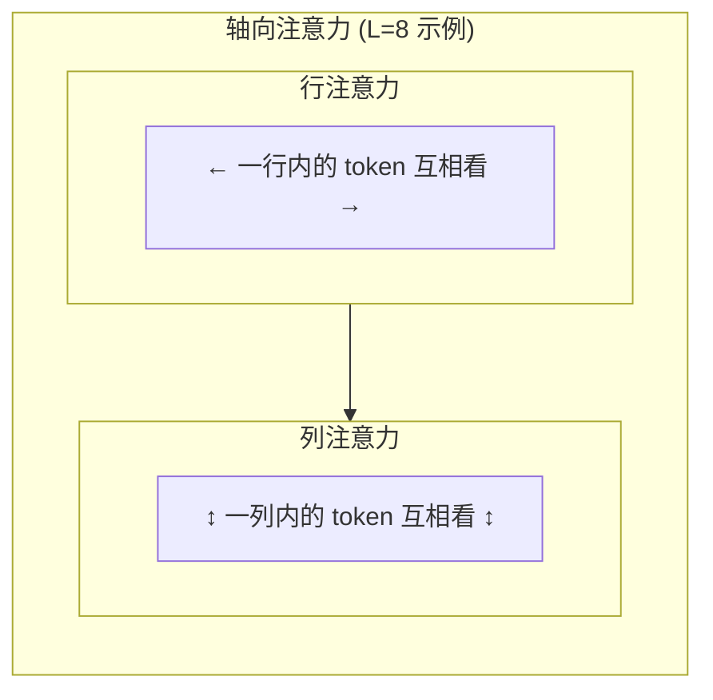

**膨胀 (Dilation) 的含义**：

```
Dilation=1:  看相邻 patch（局部细节）
  [x] [x] [x] [x] [x] [x] [x] [x]   ← 每个都参与注意力

Dilation=2:  每隔1个看（中程模式）
  [x] [ ] [x] [ ] [x] [ ] [x] [ ]   ← 只有标记的参与

Dilation=4:  每隔3个看（长程依赖）
  [x] [ ] [ ] [ ] [x] [ ] [ ] [ ]   ← 更稀疏，视野更远
```

**SymFold v4 的膨胀模式**: `[1,1,1, 2,2,2, 4,4,4]`

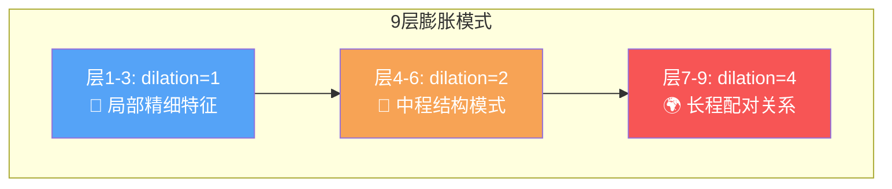

**为什么不直接用大感受野？** 因为浅层需要先学好局部模式（stem 内部的反对角线），深层才需要远距离推理（两个远处的 stem 如何协调）。

**额外细节**：
- **RoPE**（旋转位置编码）：比可学习位置编码更好泛化到不同长度序列
- **QK-Norm**（RMSNorm）：稳定深层训练，防止注意力 logit 爆炸

---

#### 4.3.3 Triangle Multiplicative Update（三角更新，v4 新增）

**这是 v4 最重要的新增模块**，灵感来自 AlphaFold2。

**物理含义**：如果 i 和 k 有关系，k 和 j 也有关系，那么 i 和 j 之间也应该有某种约束。

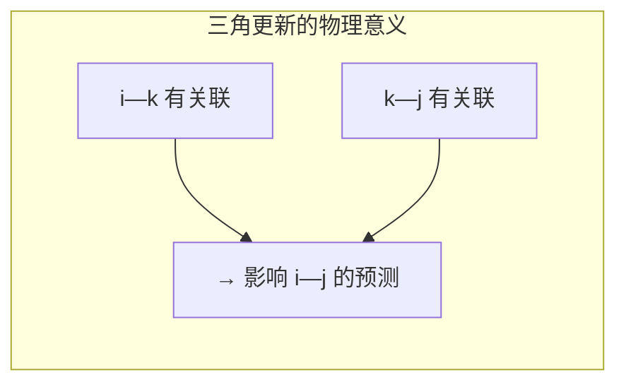

**数学形式**：
```python
# 对每对 (i,j)，综合所有"中间节点 k"的信息
tri[i,j] = Σ_k  left[i,k] * right[k,j]   # 类似矩阵乘法！
output = z + gate * tri                     # 残差 + 门控
```

**为什么只在后 3 层 (层6-8) 启用？**
- 前面的层还在学基础表示，过早引入三体约束反而干扰
- 后面的层表示已经足够好，三角更新能有效传播约束信息
- 减少计算开销（Triangle Update 计算量较大）

---

#### 4.3.4 FiLM 调制（UFold 空间条件注入）

**作用**：将 UFold 提取的空间结构特征注入到每一层。

```python
# FiLM = Feature-wise Linear Modulation
scale = linear_scale(u_cond)   # 来自 UFold 的空间信息
shift = linear_shift(u_cond)
x = x * scale + shift          # 逐像素调制
```

与 AdaLN 的区别：
- **AdaLN**: 全局条件（时间步），对所有位置施加相同调制
- **FiLM**: 空间条件（UFold），**不同位置有不同的调制**

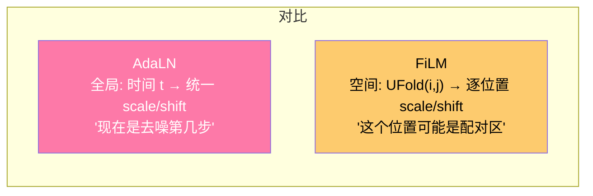

---

#### 4.3.5 GatedFFN（SwiGLU）

**作用**：非线性变换，增加模型表达能力。

```python
# 传统 FFN:
output = W2(GELU(W1(x)))

# SwiGLU (v4 使用):
output = W3( SiLU(W1(x)) ⊙ W2(x) )
#              ↑ 门控信号     ↑ 信息流
#         两路分别变换，然后门控相乘
```

**为什么 SwiGLU 比普通 FFN 好？**
- 门控机制让网络选择性地通过信息
- LLaMA、PaLM 等大模型都用这个
- 参数效率更高（补偿比例 2/3）

---

## 4.5 完整 Shape 变换表（逐层追踪）

以 **L=160**（序列长度 160nt）、**B=4**（batch size）为例，追踪每一步的 tensor shape：

### 阶段一：条件提取

| 步骤 | 操作 | 输入 Shape | 输出 Shape | 说明 |
|:----:|------|:----------:|:----------:|------|
| 1 | RNA-FM 前向 | `tokens: (4, 162)` | 4×`(4, 160, 640)` + `(4, 240, 160, 160)` | 162=L+2 (BOS/EOS); 输出 4 层 embedding + attention maps |
| 2 | Multi-Layer FM Fusion | 4×`(4, 160, 640)` | `(4, 160, 16)` | 每层 Linear(640→16) → concat(64) → MLP(64→32→16) |
| 3 | UFold 前向 | `data_fcn_2: (4, 17, 160, 160)` | `u_cond: (4, 8, 160, 160)` | U-Net 5级编解码 → Conv1x1(32→8) → 对称化 |

### 阶段二：噪声化（训练时）

| 步骤 | 操作 | 输入 Shape | 输出 Shape | 说明 |
|:----:|------|:----------:|:----------:|------|
| 4 | 采样时间 | — | `t: (4,)` | Uniform(0,1) |
| 5 | 对称化 GT | `contact: (4, 1, 160, 160)` | `x_1: (4, 1, 160, 160)` | max(C, C^T) |
| 6 | 构造 x_t | `x_1, t` | `x_t: (4, 1, 160, 160)` | Bernoulli(t·x₁ + (1-t)·0.005), {0,1} |

### 阶段三：特征组装 → 48 通道输入

| 步骤 | 操作 | 输入 Shape | 输出 Shape | 说明 |
|:----:|------|:----------:|:----------:|------|
| 7 | x_t Embedding | `x_t: (4, 1, 160, 160)` → long | `(4, 8, 160, 160)` | Embedding(2, 8), 0/1 → 8D 向量 |
| 8 | FM → 2D 投影 | `fm_fused: (4, 160, 16)` | `(4, 16, 160, 160)` | Linear(16→8) → (4,8,160) → outer_concat → (4,16,160,160) |
| 9 | FM attn 投影 | `fm_attn: (4, 240, 160, 160)` | `(4, 8, 160, 160)` | Conv1x1(240→16→8), 然后对称化 |
| 10 | Seq → 2D | `seq_oh: (4, 160, 4)` | `(4, 8, 160, 160)` | permute → (4,4,160) → outer_concat → (4,8,160,160) |
| 11 | UFold 条件 | — | `(4, 8, 160, 160)` | 直接使用步骤 3 输出 |
| **12** | **Concat + 对称化** | 5 个分支 | **`(4, 48, 160, 160)`** | cat → symmetrize: 0.5*(f + f^T) |

### 阶段四：DiT Backbone（核心计算）

| 步骤 | 操作 | 输入 Shape | 输出 Shape | 说明 |
|:----:|------|:----------:|:----------:|------|
| **13** | **PatchEmbed2D** | `(4, 48, 160, 160)` | **`(4, 40, 40, 256)`** | Conv2d(48→256, k=4, s=4) + LayerNorm; **160/4=40** |
| 14 | UFold patch embed | `u_cond: (4, 8, 160, 160)` | `(4, 40, 40, 256)` | Conv2d(8→256, k=4, s=4), 加到 tokens 上 |
| 15 | Time embedding | `t: (4,)` | `(4, 256)` | Sinusoidal → MLP(256→256→256) |
| 16 | FM global | `fm_fused: (4, 160, 16)` | `(4, 256)` | mean → MLP(16→256→256) |
| 17 | UFold global | `u_cond: (4, 8, 160, 160)` | `(4, 256)` | mean → MLP(8→256→256) |
| **18** | **Global Cond Fuse** | 3×`(4, 256)` | **`cond: (4, 256)`** | cat(768) → Linear(768→256) |
| **19** | **Block 1** (d=1) | `(4, 40, 40, 256)` + `cond` | `(4, 40, 40, 256)` | AdaLN → AxialAttn(d=1) → FiLM → SwiGLU |
| **20** | **Block 2** (d=1) | `(4, 40, 40, 256)` | `(4, 40, 40, 256)` | 同上 |
| **21** | **Block 3** (d=1) | `(4, 40, 40, 256)` | `(4, 40, 40, 256)` | 同上 |
| **22** | **Block 4** (d=2) | `(4, 40, 40, 256)` | `(4, 40, 40, 256)` | AdaLN → AxialAttn(d=2) → FiLM → SwiGLU |
| **23** | **Block 5** (d=2) | `(4, 40, 40, 256)` | `(4, 40, 40, 256)` | 同上 |
| **24** | **Block 6** (d=2) | `(4, 40, 40, 256)` | `(4, 40, 40, 256)` | 同上 |
| **25** | **Block 7** (d=4, +Tri) | `(4, 40, 40, 256)` | `(4, 40, 40, 256)` | AdaLN → AxialAttn(d=4) → **TriangleUpdate** → FiLM → SwiGLU |
| **26** | **Block 8** (d=4, +Tri) | `(4, 40, 40, 256)` | `(4, 40, 40, 256)` | 同上 |
| **27** | **Block 9** (d=4, +Tri) | `(4, 40, 40, 256)` | `(4, 40, 40, 256)` | 同上 |
| **28** | **Final AdaLN** | `(4, 40, 40, 256)` + `cond` | `(4, 40, 40, 256)` | LayerNorm → scale/shift 调制 |
| **29** | **UnPatchify2D** | `(4, 40, 40, 256)` | **`(4, 1, 160, 160)`** | Linear(256→16) → reshape → (4,1,40×4, 40×4) |

### 阶段五：后处理

| 步骤 | 操作 | 输入 Shape | 输出 Shape | 说明 |
|:----:|------|:----------:|:----------:|------|
| 30 | 对称化 | `(4, 1, 160, 160)` | `(4, 1, 160, 160)` | 0.5 × (logit + logit^T) |
| 31 | Short-range mask | `(4, 1, 160, 160)` | `(4, 1, 160, 160)` | \|i-j\|<3 的位置设为 -10 |
| 32 | Padding mask | `(4, 1, 160, 160)` | `(4, 1, 160, 160)` | 超出实际长度的位置设为 -10 |
| 33 | Density head | `cond: (4, 256)` | `(4, 1)` | Linear(256→128→1) + Sigmoid |

### DASEDiTBlock_v4 内部 Shape（单个 Block 展开）

以 Block 7 (dilation=4, use_triangle=True) 为例，输入 `x: (4, 40, 40, 256)`：

| 子步骤 | 操作 | Shape 变化 | 说明 |
|:------:|------|:----------:|------|
| a | AdaLN-Zero | `(4,40,40,256)` → 不变 | cond→MLP→6×256 (scale₁,shift₁,gate₁,scale₂,shift₂,gate₂) |
| b | LayerNorm + scale/shift | `(4,40,40,256)` → 不变 | x = norm(x) × (1+scale₁) + shift₁ |
| c | **Row Attention (d=4)** | `(4,40,40,256)` → 不变 | 行维度: 40 tokens, 每隔4取→10组×4并行; QKV 各 (4×40, 10, 64) |
| d | **Col Attention (d=4)** | `(4,40,40,256)` → 不变 | 列维度: 同上，转置后操作 |
| e | gate₁ 门控 | 不变 | x = x_orig + gate₁ × attn_out |
| f | **TriangleUpdate** | `(4,40,40,256)` → 不变 | left(256→64), right(256→64), einsum('bikd,bjkd→bijd'), gate |
| g | FiLM (UFold) | 不变 | u_cond↓patch → scale,shift; x = x×scale + shift |
| h | LayerNorm + scale₂/shift₂ | 不变 | |
| i | **SwiGLU FFN** | `(4,40,40,256)` → `(4,40,40,682)` → `(4,40,40,256)` | 中间维度=256×4×2/3≈682 |
| j | gate₂ 门控 | 不变 | x = x_prev + gate₂ × ffn_out |

### Shape 速查表（不同序列长度）

| 序列长度 L | 输入图大小 | Patch 后 token grid | Token 数 | 显存占用估计 |
|:----------:|:---------:|:-------------------:|:--------:|:-----------:|
| 80 | 80×80 | 20×20 | 400 | ~2 GB |
| 160 | 160×160 | 40×40 | 1,600 | ~5 GB |
| 240 | 240×240 | 60×60 | 3,600 | ~10 GB |
| 320 | 320×320 | 80×80 | 6,400 | ~18 GB |
| 480 | 480×480 | 120×120 | 14,400 | ~45 GB |
| 640 | 640×640 | 160×160 | 25,600 | ~80 GB |

> 显存占用为 fp32 单样本估计，实际取决于 batch size。Axial attention 的复杂度为 O(B × H × W × max(H,W))，即 O(token_grid_side³)。

### 关键 Shape 图示

```
序列长度 L=160, Batch=4

┌─────────────────────────────────────────────────────────────────┐
│  条件提取                                                        │
│  tokens (4,162) ─→ RNA-FM ─→ 4×(4,160,640) + (4,240,160,160)  │
│  data_fcn_2 (4,17,160,160) ─→ UFold ─→ (4,8,160,160)          │
└─────────────────────────────────────────────────────────────────┘
                              ↓
┌─────────────────────────────────────────────────────────────────┐
│  特征组装 (5个分支 → concat)                                      │
│                                                                  │
│  x_t_emb:   (4, 8, 160,160)  ← Embedding({0,1}→8D)            │
│  fm_2d:     (4,16, 160,160)  ← FM fusion → proj → outer_concat │
│  fm_attn:   (4, 8, 160,160)  ← Conv1x1 压缩                    │
│  seq_2d:    (4, 8, 160,160)  ← one-hot → outer_concat          │
│  u_cond:    (4, 8, 160,160)  ← UFold 直出                      │
│  ─────────────────────────────────────────────────               │
│  concat:    (4, 48, 160, 160)  → symmetrize                     │
└─────────────────────────────────────────────────────────────────┘
                              ↓
┌─────────────────────────────────────────────────────────────────┐
│  PatchEmbed: Conv2d(48→256, k=4, s=4)                           │
│                                                                  │
│  (4, 48, 160, 160)  ──→  (4, 40, 40, 256)                      │
│   ↑                        ↑                                     │
│   原始空间                   patch 化的 2D token grid              │
│   L×L 像素                  (L/4)×(L/4) 个 token, 每个 256D       │
└─────────────────────────────────────────────────────────────────┘
                              ↓
┌─────────────────────────────────────────────────────────────────┐
│  9× DASEDiTBlock_v4   (shape 始终为 (4, 40, 40, 256))            │
│                                                                  │
│  Block 1-3: dilation=1, 局部细节                                  │
│  Block 4-6: dilation=2, 中程模式                                  │
│  Block 7-9: dilation=4 + TriangleUpdate, 长程+三体约束            │
│                                                                  │
│  每个 Block:                                                      │
│    (4,40,40,256) → AdaLN → AxialAttn → [Triangle] → FiLM → FFN │
│    → (4,40,40,256)  (shape 不变！)                                │
└─────────────────────────────────────────────────────────────────┘
                              ↓
┌─────────────────────────────────────────────────────────────────┐
│  UnPatchify: Linear(256→1×4×4=16) + reshape                     │
│                                                                  │
│  (4, 40, 40, 256)  ──→  (4, 1, 160, 160)                       │
│                           ↑                                      │
│                           恢复原始 L×L 分辨率，1 通道 logit        │
└─────────────────────────────────────────────────────────────────┘
                              ↓
┌─────────────────────────────────────────────────────────────────┐
│  后处理                                                           │
│  symmetrize → short-range mask → padding mask                    │
│  输出: logit (4, 1, 160, 160)  ← sigmoid 后即为配对概率           │
└─────────────────────────────────────────────────────────────────┘
```

---

## 五、离散流匹配 (Discrete Flow Matching) 详解

这是 SymFold 的"灵魂"，理解它才能理解模型为什么这样设计。

### 5.1 核心思想

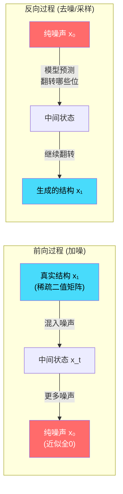

### 5.2 前向过程（训练时）

```python
# 给定真实接触图 x₁, 在时间 t ∈ [0,1] 构造噪声版本：
P(x_t[i,j] = 1) = t × x₁[i,j] + (1-t) × ρ₀

# ρ₀ = 0.005 = 背景噪声率
# t=0 时: P=ρ₀=0.005, 几乎全是0 (纯噪声)
# t=1 时: P=x₁, 恢复真实结构
# t=0.5 时: 一半信号一半噪声
```

**模型的训练目标**：给定 `(x_t, t)`，预测真实结构 `x₁` 的概率。

### 5.3 反向过程（推理时 τ-leap 采样）


每一步的核心操作：
```python
for step in range(20):
    logit = model(x_t, t)           # 模型预测
    p_x1 = sigmoid(logit)           # 预测的"真实结构"概率
    
    # 计算 CTMC 翻转率
    rate_01 = clamp(p_x1 - ρ₀) / P(x_t=0)   # 0→1 的概率
    rate_10 = clamp(ρ₀ - p_x1) / P(x_t=1)   # 1→0 的概率
    
    # 随机翻转
    flip_01 = Bernoulli(rate_01 × dt) & (x_t == 0)
    flip_10 = Bernoulli(rate_10 × dt) & (x_t == 1)
    x_t = x_t + flip_01 - flip_10
    x_t = symmetrize(x_t)           # 保持对称
```

### 5.4 最终投影

采样完成后，输出可能不满足物理约束（如某行有多个1）。需要 **Greedy Max-Matching** 投影：

```python
def project_to_valid(logit):
    """贪心最大匹配，确保每个碱基最多配一次"""
    scores = sigmoid(logit)
    scores[|i-j| < 3] = 0     # 距离太近不能配对
    
    while scores.max() > threshold:
        i, j = argmax(scores)   # 找最高分的一对
        result[i,j] = result[j,i] = 1
        scores[i, :] = scores[:, i] = 0   # 清零该行/列
        scores[j, :] = scores[:, j] = 0
    
    return result
```

---

## 六、数据流完整图

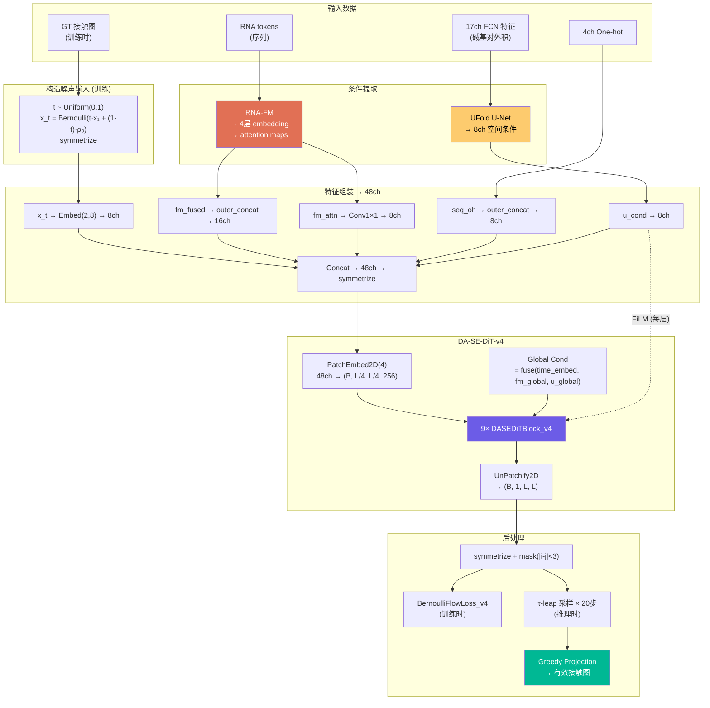

---

## 七、版本对比：从 v1 到 v4 的关键改进

| 特性 | v1 (Baseline) | v3 (设计) | v4 (当前) |
|------|---------------|-----------|-----------|
| **层数** | 6 | 8-10 (规划) | **9** |
| **隐藏维度** | 192 | 256 (规划) | **256** |
| **RNA-FM 使用** | 仅最后一层 | 多层 (规划) | **4层融合 + 可学习权重** |
| **位置编码** | 可学习 PE | - | **RoPE** |
| **FFN** | GELU FFN | - | **SwiGLU** |
| **三角更新** | ❌ 无 | ✅ 全层 (规划) | **✅ 后3层** |
| **QK-Norm** | ❌ | - | **✅ RMSNorm** |
| **Dilation** | 无/固定 | - | **[1,1,1,2,2,2,4,4,4]** |
| **损失函数** | 固定 pos_weight | Focal (规划) | **自适应 pos_weight + Focal + Stacking + NonCrossing + Density** |
| **输出头** | sigmoid | Row-Softmax (尝试失败) | **sigmoid + greedy projection** |
| **参数量** | ~13M trainable | - | **~25.1M trainable** |

### 关键教训

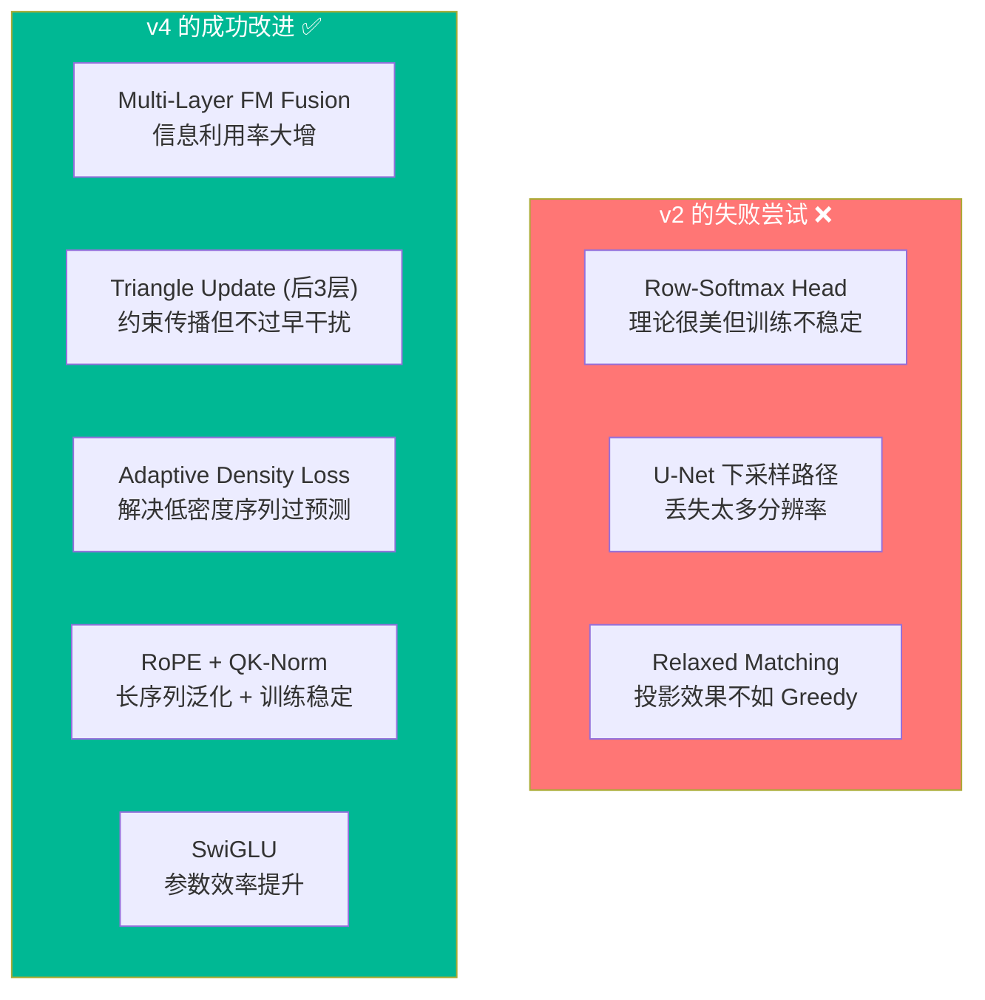

---

## 八、损失函数设计（v4）

损失函数也是经过精心设计的，解决了 RNA 结构预测的几个特殊困难：

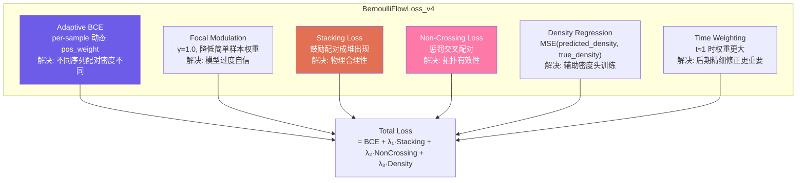

**Adaptive pos_weight 的核心逻辑**：
```python
# 密度高的序列 (配对多) → 较低的 pos_weight
# 密度低的序列 (配对少) → 较高的 pos_weight
density = actual_pairs / L
pos_weight = clamp(pos_weight_base / (density * L), min=50, max=199)
```

---

## 九、关键设计决策汇总

| 决策 | 选择 | 为什么 |
|------|------|--------|
| 生成框架 | Discrete Flow Matching | 接触图是二值的，离散比连续 (DDPM) 更自然 |
| 对称性 | 显式 `symmetrize()` | 物理硬约束，不能靠模型隐式学 |
| 注意力类型 | Axial (行+列分解) | O(L³) vs O(L⁴)，保持等变性 |
| 膨胀策略 | 递增 [1,2,4] | 不降分辨率就能捕获多尺度 |
| 条件注入 | 双路径 (AdaLN + FiLM) | 全局时间语义 + 空间结构 |
| 三角更新 | AF2 启发, 仅后3层 | 三体约束很强但计算贵 |
| 投影方式 | Greedy max-matching | v2 试过 relaxed/Sinkhorn, 不如 greedy |
| 正样本权重 | 自适应 per-sample | 不同序列密度差异巨大 |

---

## 十、模型超参配置速查

```json
{
  "hidden_dim": 256,
  "num_heads": 4,
  "dim_head": 64,
  "num_layers": 9,
  "patch_size": 4,
  "max_len": 640,
  "dilation_pattern": [1,1,1, 2,2,2, 4,4,4],
  "tri_start_layer": 6,
  "tri_dim": 64,
  "rho_0": 0.005,
  "dropout": 0.1,
  "ffn_type": "swiglu",
  "pos_embed": "rope",
  "qk_norm": true,
  "pos_weight_base": 199.0,
  "pos_weight_min": 50.0,
  "focal_gamma": 1.0,
  "num_sampling_steps": 20,
  "sampling_schedule": "cosine"
}
```

---

## 十一、文件导航

想深入代码？看这些文件：

| 想了解... | 看这个文件 |
|-----------|-----------|
| 主模型组装 | `src/v4/model.py` |
| Backbone 所有子模块 | `src/v4/da_se_dit.py` |
| 离散流匹配 + 损失 + 采样 | `src/v4/discrete_flow.py` |
| UFold 条件编码器 | `src/models/condition/u_conditioner.py` |
| RNA-FM 加载 | `src/models/condition/fm_conditioner/pretrained.py` |
| 训练配置 | `train/config/train_config_v4.json` |
| 训练循环 | `train/train_v4.py` |
