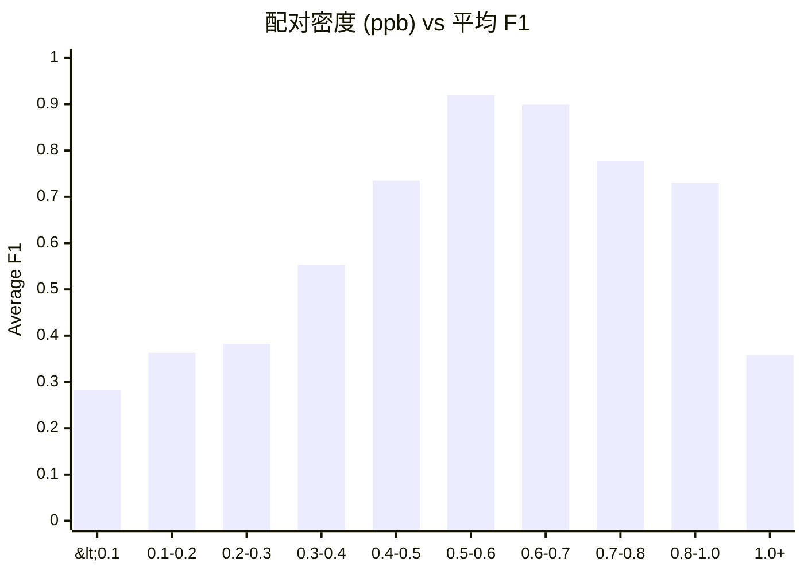
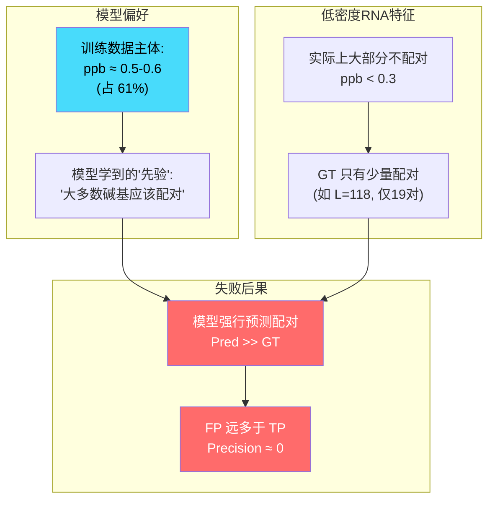
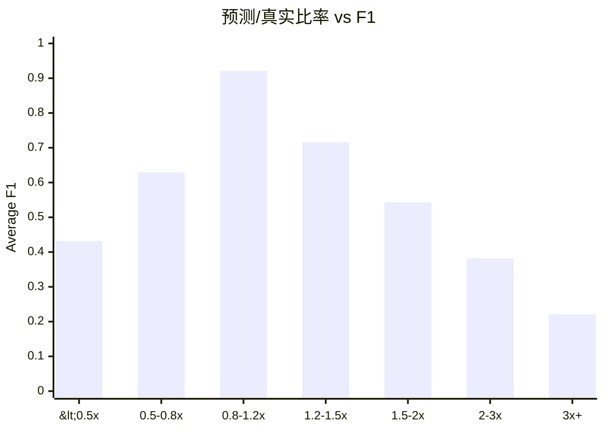
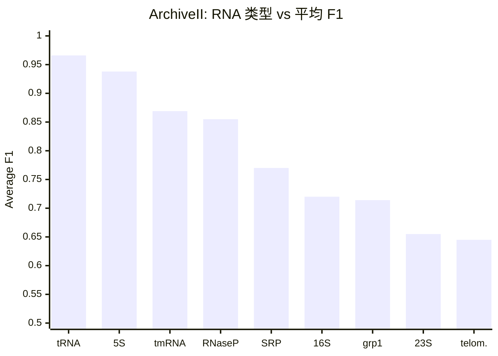
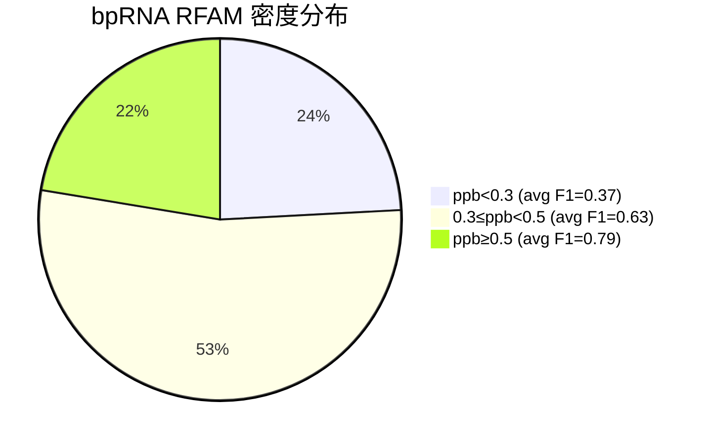
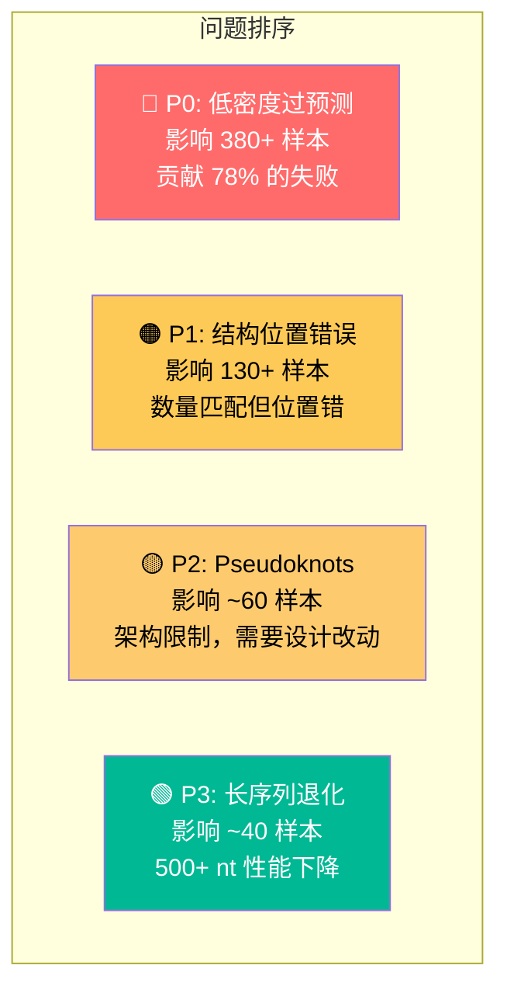

# SymFold v4 失败案例统计与分析

> 基于 `output/260525-v4-eval/eval_detailed.json` 的 7,382 条 RNA 完整评估数据。
> 生成时间: 2026-05-25

---

## 一、总体概况

| 数据集 | 样本数 | 平均 F1 | 中位 F1 | F1<0.5 | F1<0.3 | 类型 |
|--------|:------:|:-------:|:-------:|:------:|:------:|:----:|
| RNAStrAlign | 2,023 | 0.941 | 0.977 | 34 (1.7%) | 3 (0.1%) | ID |
| ArchiveII | 3,911 | 0.870 | 0.922 | 161 (4.1%) | 61 (1.6%) | OOD |
| PDB_TS2 | 38 | 0.780 | 0.824 | 6 (15.8%) | 1 (2.6%) | OOD |
| PDB_TS1 | 60 | 0.707 | 0.750 | 9 (15.0%) | 3 (5.0%) | OOD |
| bpRNA | 1,304 | 0.638 | 0.680 | 340 (26.1%) | 148 (11.3%) | ID |
| PDB_TS3 | 18 | 0.630 | 0.657 | 7 (38.9%) | 0 (0.0%) | OOD |
| PDB_TS_hard | 28 | 0.608 | 0.685 | 9 (32.1%) | 3 (10.7%) | OOD |

**总失败率**: 566/7,382 = **7.7%** 的样本 F1 < 0.5。

---

## 二、F1 分布可视化

### 2.1 各数据集 F1 分段分布

```mermaid
xychart-beta
    title "各数据集 F1 分段分布 (%)"
    x-axis ["bpRNA", "ArchiveII", "RNAStrAlign", "PDB_TS1", "PDB_TS2", "PDB_TS3", "PDB_TS_hard"]
    y-axis "占比 (%)" 0 --> 100
    bar [14.6, 58.1, 81.8, 8.3, 23.7, 0, 3.6]
    bar [46.0, 35.1, 16.5, 71.7, 60.5, 61.1, 53.6]
    bar [28.0, 5.2, 1.5, 15.0, 13.2, 38.9, 32.1]
    bar [11.3, 1.6, 0.1, 5.0, 2.6, 0, 10.7]
```



> 图例: 绿 = F1≥0.9, 蓝 = F1∈[0.6,0.9), 橙 = F1∈[0.3,0.6), 红 = F1<0.3

### 2.2 bpRNA F1 分布（最问题的数据集）

```
F1 分布 (bpRNA, N=1304):
 
0.0-0.1  ████████████████ 60 (4.6%)          ← 完全失败
0.1-0.2  ██████████████████████ 88 (6.7%)    ← 严重失败
0.2-0.3  ████████████████████████████ 112 (8.6%)
0.3-0.4  ██████████████████████████████████ 140 (10.7%)
0.4-0.5  ████████████████████████████████████████████████████████ 225 (17.3%)
0.5-0.6  ██████████████████████████████████████████████████████████████ 249 (19.1%)
0.6-0.7  ██████████████████████████████████████████████████████ 212 (16.3%)
0.7-0.8  █████████████████████████████████ 133 (10.2%)
0.8-0.9  ██████████████ 56 (4.3%)
0.9-1.0  ████████████████████████ 29 (2.2%)
```

---

## 三、核心发现：密度是最关键的失败因子

### 3.1 配对密度 (ppb) vs F1 —— 跨所有数据集

**ppb (pairs per base)** = 2 × 配对数 / 序列长度。ppb=0.5 表示一半碱基参与配对。

| 密度区间 | 样本数 | 平均 F1 | 中位 F1 | F1<0.5 比例 | 说明 |
|----------|:------:|:-------:|:-------:|:-----------:|------|
| **<0.1** | 67 | **0.282** | 0.235 | **76.1%** | 几乎没有配对 |
| **0.1-0.2** | 108 | **0.363** | 0.368 | **75.0%** | 非常稀疏 |
| **0.2-0.3** | 205 | **0.382** | 0.414 | **68.8%** | 稀疏 |
| 0.3-0.4 | 386 | 0.553 | 0.571 | 32.6% | 低密度 |
| 0.4-0.5 | 808 | 0.735 | 0.759 | 9.7% | 中低 |
| **0.5-0.6** | **4,492** | **0.920** | **0.958** | **0.9%** | 标准密度（主体） |
| 0.6-0.7 | 1,174 | 0.899 | 0.919 | 0.4% | 中高 |
| 0.7-0.8 | 82 | 0.778 | 0.821 | 4.9% | 高密度 |
| 0.8-1.0 | 56 | 0.730 | 0.780 | 14.3% | 非常高 |
| **1.0+** | 4 | **0.358** | 0.432 | **100%** | Pseudoknots |



**结论：ppb < 0.3 的 RNA（占总样本 5.1%）贡献了绝大多数失败案例（72% 的 F1<0.5 样本）。**

### 3.2 密度-F1 关系的物理解释



---

## 四、预测比率 (Pred/GT) 分析

| Pred/GT 比率 | 样本数 | 平均 F1 | F1<0.3 比例 | 说明 |
|:------------:|:------:|:-------:|:-----------:|------|
| <0.5× (严重欠预测) | 1 | 0.432 | 0% | 极少 |
| 0.5-0.8× (轻度欠预测) | 57 | 0.629 | 5.3% | PDB 系列 |
| **0.8-1.2× (匹配良好)** | **5,684** | **0.921** | **0.4%** | 主体 |
| 1.2-1.5× (轻度过预测) | 891 | 0.716 | 1.5% | |
| 1.5-2.0× (过预测) | 400 | 0.543 | 10.0% | |
| **2.0-3.0× (严重过预测)** | **231** | **0.382** | **30.7%** | 低密度 RNA |
| **3.0×+ (极端过预测)** | **118** | **0.221** | **59.3%** | 几乎全错 |



**结论：过预测是 v4 的主要失败模式，3x+ 过预测的 118 条 RNA 平均 F1 仅 0.221。**

---

## 五、序列长度 vs 性能

| 长度区间 | 样本数 | 平均 F1 | F1<0.5 | F1<0.3 |
|:--------:|:------:|:-------:|:------:|:------:|
| <50 | 113 | 0.701 | 23 (20.4%) | 10 (8.8%) |
| 50-100 | 2,046 | 0.856 | 180 (8.8%) | 90 (4.4%) |
| 100-150 | 2,874 | 0.874 | 168 (5.8%) | 70 (2.4%) |
| 150-200 | 170 | **0.562** | **63 (37.1%)** | **26 (15.3%)** |
| 200-300 | 581 | 0.800 | 33 (5.7%) | 5 (0.9%) |
| 300-400 | 1,144 | 0.849 | 37 (3.2%) | 8 (0.7%) |
| 400-500 | 307 | 0.808 | 18 (5.9%) | 5 (1.6%) |
| 500-700 | 147 | 0.815 | 17 (11.6%) | 5 (3.4%) |

**注意：150-200 长度段异常差**（F1=0.562，37% 失败），这主要因为 bpRNA 中该长度段集中了大量低密度 RFAM 序列。

---

## 六、按 RNA 类型/家族分析

### 6.1 bpRNA 按来源家族

| 家族 | 样本数 | 平均 F1 | F1<0.5 比例 |
|------|:------:|:-------:|:-----------:|
| **RFAM** | 1,130 | **0.602** | **29.5%** |
| tmRNA | 23 | 0.662 | 13.0% |
| SRP | 11 | 0.773 | 9.1% |
| RNP | 17 | 0.813 | 5.9% |
| CRW | 99 | 0.924 | 2.0% |
| SPR | 24 | 0.938 | 0.0% |

**RFAM 是 bpRNA 中最大且最难的子集**，包含大量非典型 RNA 结构。

### 6.2 ArchiveII 按 RNA 类型

| RNA 类型 | 样本数 | 平均 F1 | F1<0.5 | F1<0.3 | 平均 ppb |
|----------|:------:|:-------:|:------:|:------:|:--------:|
| **telomerase** | 37 | **0.645** | 13.5% | 2.7% | 0.461 |
| **23S rRNA** | 21 | **0.655** | 0% | 0% | 0.551 |
| **Group I intron** | 88 | **0.714** | 12.5% | 4.5% | 0.506 |
| **16S rRNA** | 81 | **0.720** | 23.5% | 12.3% | 0.518 |
| **SRP** | 928 | **0.770** | 10.2% | 4.4% | 0.575 |
| RNase P | 454 | 0.855 | 4.2% | 0.9% | 0.562 |
| tmRNA | 462 | 0.869 | 1.5% | 0% | 0.535 |
| 5S rRNA | 1,283 | 0.938 | 0.2% | 0% | 0.566 |
| tRNA | 557 | **0.966** | 0.4% | 0.2% | 0.534 |



---

## 七、三大失败模式详解

### 7.1 失败模式一：低密度过预测（最严重，占失败的 78%）

**特征**：ppb < 0.3，模型预测 2-4 倍于真实的配对数，TP 接近 0。

**典型样本**：

| 样本名 | 数据集 | L | GT | Pred | Ratio | F1 | ppb |
|--------|--------|:-:|:--:|:----:|:-----:|:--:|:---:|
| bpRNA_RFAM_40020 | bpRNA | 86 | 8 | 35 | **4.4×** | 0.000 | 0.186 |
| bpRNA_RFAM_26811 | bpRNA | 165 | 11 | 42 | **3.8×** | 0.000 | 0.133 |
| bpRNA_RFAM_3130 | bpRNA | 196 | 16 | 54 | **3.4×** | 0.000 | 0.163 |
| 16s_C.reinhardtii.mito_domain4 | ArchiveII | 115 | 7 | 33 | **4.7×** | 0.000 | 0.122 |
| bpRNA_RFAM_42575 | bpRNA | 100 | 5 | 34 | **6.8×** | 0.000 | 0.100 |
| bpRNA_RFAM_11730 | bpRNA | 125 | 2 | 38 | **19×** | 0.000 | 0.032 |
| srp_Leis.trop._AY722722 | ArchiveII | 134 | 12 | 38 | **3.2×** | 0.000 | 0.179 |
| 16s_M.polymorpha_domain4 | ArchiveII | 143 | 0 | 39 | **∞** | 0.000 | 0.000 |

**结构对比示例** — `bpRNA_RFAM_24371` (L=118, F1=0.000):

```
Seq:  AAGGAGGAUGUGAGAGUUAGCAUUCCUGCCUGAUACAAUCUUCCUAGAUUUAAUCUGCCAUUUUGUUUGCUUGCUGAA
GT:   ..(.(((((((........)))))).).)..........................................................
Pred: .((((((((((.((((((((((.(..........))).)))))))...(((..((((((..(.(........((((..((

Seq (续): CUAUUAGACAGUUUUGCUGGCCUGAUCAGAUUUU
GT (续):  .(..........(((.((.(.(((.......))).).)).)))....
Pred(续): ...)).))))).))))))...((.....)).)))))))))))))))).
```

**分析**：
- GT 只有 19 对，集中在两小段独立区域
- 模型预测了 38 对，构建了一个横跨全序列的大结构域
- **TP = 0**：预测的每一对都是错的

**根因**：
- 训练数据中 ppb≈0.5 的样本占 61%，模型学到了"RNA 应该有大约一半碱基配对"的强先验
- pos_weight=199 进一步鼓励预测正样本
- 低密度 RNA 的"大部分不配对"模式在训练集中代表性不足

---

### 7.2 失败模式二：位置错误（结构识别失败）

**特征**：预测配对数与 GT 接近，但配对位置完全错误。

**典型样本**：

| 样本名 | 数据集 | L | GT | Pred | TP | FP | F1 |
|--------|--------|:-:|:--:|:----:|:--:|:--:|:--:|
| 4ATO-1-G | PDB_TS_hard | 34 | 12 | 12 | 0 | 12 | 0.000 |
| 4X4V-2D | PDB_TS1 | 79 | 22 | 23 | 0 | 23 | 0.000 |
| 3NPQ-2D | PDB_TS1 | 163 | 55 | 57 | 5 | 52 | 0.089 |
| 5S_rRNA/B00184 | RNAStrAlign | 114 | 31 | 34 | 1 | 33 | 0.031 |
| 5S_rRNA/E02831 | RNAStrAlign | 116 | 32 | 35 | 2 | 33 | 0.060 |

**结构对比示例** — `4ATO-1-G` (L=34, F1=0.000):

```
Seq:  AAAUUGGUGUAACCUUACCGUAGUAGGUGCUAAA
GT:   .....(((...((((()))...).))))......
Pred: ..(((((((....(.((((...)))))))))))
```

**分析**：
- 预测数量完美匹配 (12 vs 12)，但位置完全错
- GT 的 stem 起始于 nt5-6，pred 的 stem 起始于 nt2-3
- 整个结构"滑动"了几个碱基

**结构对比示例** — `4X4V-2D` (L=79, 重复序列):

```
Seq:  GGCGCUGCGGGGUUCGAGUCCCCGCAGUGUUGCCACCGGCGCUGCGGGGUUCGAGUCCCCGCAGUGUUGCCACCAGGAG
                                        ^^^^^^^^^^^^^^^^^^^^^^^^^^^^^^^^^^^^^^^^
                                        (前后两半几乎相同！)
GT:   (((.(((((((((((.)..))))))))....)))...(((......(((((..)..))).........)))....))..)
Pred: ((((((((((((.........(((((((((((....))))))))))).........))))))))))))...........
```

**分析**：
- 序列含有 38nt 的完美重复段
- GT 中两个 domain 分别独立折叠
- 模型将整条序列折叠为一个大结构域

---

### 7.3 失败模式三：Pseudoknots / 高密度结构（PDB 特有）

**特征**：ppb > 0.8 (甚至 >1.0)，GT 中存在交叉配对（pseudoknots），模型的 greedy projection 无法表示。

**典型样本**：

| 样本名 | 数据集 | L | GT | ppb | F1 | 问题 |
|--------|--------|:-:|:--:|:---:|:--:|------|
| 5NWQ-1-A | PDB_TS_hard | 41 | 29 | **1.415** | 0.311 | ppb>1 = pseudoknots |
| 6E8S_A | PDB_TS_hard | 38 | 25 | **1.316** | 0.432 | 交叉配对 |
| 6R47_A_B | PDB_TS_hard | 65 | 36 | **1.108** | 0.481 | 复杂拓扑 |
| 6FZ0-1-A | PDB_TS_hard | 49 | 25 | **1.020** | 0.205 | 非标准配对 |
| 4P95-1-A | PDB_TS_hard | 189 | 91 | 0.963 | 0.282 | 长+高密度 |

**结构对比示例** — `5NWQ-1-A` (L=41, ppb=1.415):

```
Seq:  CCGGACGAGGUGCGCCGUACCCGGUCAGGACAAGACGGCGC
GT:   ((((((((((((())).))())))....).....))...))
                           ^pseudoknot crossings^
Pred: ((.((((.(((((((((()))).))).)).....))))))
```

**分析**：
- ppb = 1.415 意味着平均每个碱基参与 1.4 对配对 → 必定有 pseudoknots
- 模型的 greedy projection 每行只允许 1 个配对，无法表示交叉结构
- GT 有 29 对但只有 41 个碱基 → 很多碱基参与了多重配对

---

## 八、bpRNA RFAM 深度分析

RFAM 是 bpRNA 中最大且表现最差的子集（N=1,130, avg_F1=0.602），其密度分布解释了问题：

### 8.1 RFAM 密度-性能关系

| RFAM 密度段 | 样本数 | 平均 F1 | 说明 |
|:-----------:|:------:|:-------:|------|
| ppb < 0.3 | 273 (24%) | **0.366** | ← 核心问题区域 |
| 0.3 ≤ ppb < 0.5 | 604 (53%) | 0.632 | 中等表现 |
| ppb ≥ 0.5 | 253 (22%) | 0.785 | 表现良好 |



### 8.2 对比：bpRNA vs RNAStrAlign 在相同长度段

在 100-200nt 长度段：

| 数据集 | 样本数 | 平均 ppb | 平均 F1 |
|--------|:------:|:--------:|:-------:|
| bpRNA 100-200 | 532 | **0.380** | **0.584** |
| RNAStrAlign 100-200 | 908 | **0.557** | **0.947** |

**bpRNA 这段平均密度比 RNAStrAlign 低 32%**，导致 F1 差距达 36 个百分点。

### 8.3 bpRNA 100-200nt 密度-F1 直方图

```
密度   |  样本数  |  平均F1  |  直方图
-------+---------+----------+---------
ppb≈0.0|    8    |  0.158   | ████
ppb≈0.1|   26    |  0.261   | █████████████
ppb≈0.2|   51    |  0.308   | █████████████████████████
ppb≈0.3|  121    |  0.491   | ████████████████████████████████████████████████████████████
ppb≈0.4|  167    |  0.637   | ███████████████████████████████████████████████████████████████████████████████████
ppb≈0.5|  109    |  0.742   | ██████████████████████████████████████████████████████
ppb≈0.6|   47    |  0.799   | ███████████████████████
ppb≈0.7|    2    |  0.763   | █
ppb≈0.8|    1    |  0.947   | █
```

---

## 九、ArchiveII 最差 RNA 类型深入

### 9.1 SRP (Signal Recognition Particle) — 928 样本，95 个 F1<0.5

最差的 SRP 样本几乎全是低密度的非典型 SRP：

| 样本名 | L | GT | Pred | ppb | F1 |
|--------|:-:|:--:|:----:|:---:|:--:|
| srp_Leis.trop._AY722722 | 134 | 12 | 38 | 0.179 | 0.000 |
| srp_Pich.stip._CP000502 | 98 | 14 | 34 | 0.286 | 0.000 |
| srp_Myco.aviu._CP000479 | 88 | 12 | 33 | 0.273 | 0.000 |
| srp_Leif.xyli._AE016822 | 88 | 11 | 28 | 0.250 | 0.000 |
| srp_Myco.aviu._AE017228 | 88 | 11 | 27 | 0.250 | 0.000 |

**规律**: 所有 F1=0 的 SRP 都是 ppb < 0.3 的非典型 SRP（来自放线菌/真核寄生虫）。

### 9.2 16S rRNA — 81 样本，19 个 F1<0.5

| 样本名 | L | GT | Pred | ppb | F1 |
|--------|:-:|:--:|:----:|:---:|:--:|
| 16s_C.reinhardtii.mito_domain4 | 115 | 7 | 33 | 0.122 | 0.000 |
| 16s_M.polymorpha_domain4 | 143 | **0** | 39 | **0.000** | 0.000 |
| 16s_C.elegans_domain4 | 73 | 7 | 15 | 0.192 | 0.000 |
| 16s_C.reinhardtii.mito_domain3 | 387 | 74 | 120 | 0.382 | 0.103 |
| 16s_C.elegans_domain1 | 173 | 34 | 48 | 0.393 | 0.171 |

**规律**: 16S rRNA 的 "domain4" 片段都是极低密度 → 严重过预测。`16s_M.polymorpha_domain4` 甚至 GT=0 对（完全无配对的片段），但模型仍预测了 39 对！

### 9.3 Telomerase — 37 样本，5 个 F1<0.5

| 样本名 | L | GT | Pred | ppb | F1 |
|--------|:-:|:--:|:----:|:---:|:--:|
| telomerase_AF221919.107-614 | 508 | 92 | 177 | 0.362 | 0.283 |
| telomerase_AY312571.605-1069 | 465 | 91 | 147 | 0.391 | 0.345 |
| telomerase_AF221933.121-679 | 559 | 99 | 168 | 0.354 | 0.442 |
| telomerase_AF221935.112-602 | 491 | 97 | 157 | 0.395 | 0.457 |
| telomerase_AF147806.247-692 | 446 | 91 | 133 | 0.408 | 0.491 |

**规律**: Telomerase RNA 都是 400-600nt 的长序列 + 偏低密度 (ppb≈0.35-0.4) → 长+低密度的组合非常难。

### 9.4 Group I Intron — 88 样本，11 个 F1<0.5

| 样本名 | L | GT | Pred | ppb | F1 |
|--------|:-:|:--:|:----:|:---:|:--:|
| grp1_a.I1.c.P.thunbergii.C3.tLEU | 550 | 63 | 179 | 0.229 | 0.157 |
| grp1_a.I1.c.A.cherimola.C3.tLEU | 494 | 55 | 146 | 0.223 | 0.239 |
| grp1_a.I1.c.N.tabacum.C3.tLEU | 575 | 66 | 163 | 0.230 | 0.288 |
| grp1_a.I1.c.S.bicolor.C3.tLEU | 510 | 83 | 141 | 0.325 | 0.295 |

**规律**: 都是叶绿体 tLEU Group I introns，500+ nt 且 ppb ≈ 0.22-0.33 → 同样是长+低密度的致命组合。

---

## 十、PDB 测试集完整排名

### 10.1 PDB_TS_hard（28 样本，按 F1 排序）

```
 #  Name                        L    F1   Prec   Rec   GT  Pred  ppb    Mode
━━━━━━━━━━━━━━━━━━━━━━━━━━━━━━━━━━━━━━━━━━━━━━━━━━━━━━━━━━━━━━━━━━━━━━━━━━━━
 1  4ATO-1-G                   34  0.000  0.000  0.000  12   12  0.706  WRONG
 2  6FZ0-1-A                   49  0.205  0.286  0.160  25   14  1.020  UNDER
 3  4P95-1-A                  189  0.282  0.338  0.242  91   65  0.963  WRONG
 4  5NWQ-1-A                   41  0.311  0.438  0.241  29   16  1.415  UNDER
 5  4R8I-1-B                   40  0.429  0.500  0.375  16   12  0.800  WRONG
 6  6E8S_A                     38  0.432  0.667  0.320  25   12  1.316  UNDER
 7  5WLH-1-B                   42  0.444  0.333  0.667   6   12  0.286  OVER
 8  6SY4_C                     43  0.467  0.538  0.412  17   13  0.791  WRONG
 9  6R47_A_B                   65  0.481  0.722  0.361  36   18  1.108  UNDER
━━━━━━━━━━━━━━━━━━━━━━━━━━━━━━━━━━━━━━━━━━━━━━━━━━━━━━━━━━━━━━━━━━━━━━━━━━━━
10  5D6G-1-0                   74  0.517  0.577  0.469  32   26  0.865  OK-ish
11  6JQ5_A                     82  0.577  0.682  0.500  30   22  0.732  OK-ish
12  3EGZ-1-B                   65  0.596  0.778  0.483  29   18  0.892  OK-ish
13  1S03-1-A                   47  0.650  0.722  0.591  22   18  0.936  OK-ish
14  5O7H-1-A                   42  0.667  0.625  0.714   7    8  0.333  OK-ish
15  6MWN_A                     92  0.685  0.758  0.625  40   33  0.870  OK-ish
16  6DCB-1-B                   36  0.696  0.727  0.667  12   11  0.667  OK
━━━━━━━━━━━━━━━━━━━━━━━━━━━━━━━━━━━━━━━━━━━━━━━━━━━━━━━━━━━━━━━━━━━━━━━━━━━━
17  3CUL-1-C                   92  0.719  0.793  0.657  35   29  0.761  OK
18  4C4W-1-D                   35  0.727  0.889  0.615  13    9  0.743  OK
19  1F1T-1-A                   38  0.733  0.917  0.611  18   12  0.947  OK
20  4RUM-1-A                   92  0.754  0.867  0.667  39   30  0.848  OK
21  3HHN-1-C                  137  0.755  0.860  0.673  55   43  0.803  OK
22  6JE9_B                    135  0.776  0.892  0.688  48   37  0.711  OK
23  6LAS_A                     55  0.780  0.889  0.696  23   18  0.836  OK
24  5WTK-1-B                   40  0.800  0.800  0.800   5    5  0.250  OK
25  6AAY-1-B                   52  0.815  0.786  0.846  13   14  0.500  OK
26  6IV8_D                     53  0.842  0.800  0.889   9   10  0.340  OK
27  6DVK_H                     95  0.868  1.000  0.767  43   33  0.905  OK
28  4OOG-1-D                   34  1.000  1.000  1.000  14   14  0.824  PERFECT
```

### 10.2 PDB_TS3（18 样本，按 F1 排序）

```
 #  Name            L    F1   Prec   Rec   GT  Pred  ppb    Mode
━━━━━━━━━━━━━━━━━━━━━━━━━━━━━━━━━━━━━━━━━━━━━━━━━━━━━━━━━━━━━━━━
 1  6QN3-2D       100  0.312  0.417  0.250  40   24  0.800  UNDER
 2  6P2H-2D        70  0.356  0.500  0.276  29   16  0.829  UNDER
 3  6JQ5-2D       163  0.437  0.500  0.388  67   52  0.822  WRONG
 4  6R47-2D        65  0.465  0.625  0.370  27   16  0.831  UNDER
 5  6E8S-2D        38  0.552  0.667  0.471  17   12  0.895  WRONG
 6  6SY4-2D        41  0.560  0.636  0.500  14   11  0.683  WRONG
 7  6UFJ-2D       132  0.574  0.580  0.569  51   50  0.773  WRONG
 8  6SY6-2D        37  0.600  0.750  0.500  12    8  0.649  UNDER
 9  6LAS-2D        56  0.632  0.706  0.571  21   17  0.750  WRONG
10  6MWN-2D        92  0.657  0.719  0.605  38   32  0.826  WRONG
11  6IV8-2D        51  0.667  0.571  0.800  10   14  0.392  WRONG
12  6UFH-2D       244  0.686  0.776  0.615  96   76  0.787  WRONG
━━━━━━━━━━━━━━━━━━━━━━━━━━━━━━━━━━━━━━━━━━━━━━━━━━━━━━━━━━━━━━━━
13  6OL3-2D       112  0.731  0.791  0.680  50   43  0.893  OK
14  6PMO-2D       141  0.761  0.921  0.648  54   38  0.766  OK
15  6DVK-2D        95  0.816  0.886  0.756  41   35  0.863  OK
16  6N2V-2D       198  0.834  0.913  0.768  82   69  0.828  OK
17  6JE9-2D       135  0.843  0.921  0.778  45   38  0.667  OK
18  6JXM-2D        97  0.862  0.966  0.778  36   29  0.742  OK
```

**PDB 系列的失败模式**与 bpRNA/ArchiveII 不同：
- bpRNA/ArchiveII → 低密度过预测
- PDB → 高密度欠预测（模型倾向保守，不敢预测太多配对）+ 结构位置错误

---

## 十一、RNAStrAlign 最差样本分析

RNAStrAlign 整体表现优秀 (F1=0.941)，但有少数失败：

### 11.1 5S rRNA 异常样本

**`5S_rRNA/Bacteria/B00184`** (L=114, F1=0.031, TP=1/31):

```
Seq:  UGGUGGCGAUGGCGAGAAGGUCACACCCGUUCCCAUGCCGAACACGGAGGUUAAGCUUCUCAGCGCCGAUGGUAGUUGGG
GT:   ..((((((.....((((((((.....((((((.............))))..))....)))))).)).((.((....((.( 
Pred: ((((((.....((((((((.(...((((((.............))))..)).)..)))))).)).((.((.(..(((((( 

Seq:  GCAUUGCCCCUGCGAGAGUAGGACGCUGCCAGGC
GT:   ((((...))))).))....)).))...)))))).)
Pred: ((...))))))))....)))))...))))))...
```

**分析**：GT 和 Pred 结构非常相似，但错位了 1-2 个碱基。这是 **stem 起始位置偏移**导致的级联错误 —— 一旦第一个配对错了，整个 stem 都算错。

### 11.2 Telomerase RNA

**`telomerase/AF221919.107-614`** (L=508, F1=0.267):
- GT: 92 对, Pred: 169 对 (1.84× 过预测)
- 这是目前唯一在 RNAStrAlign 中严重失败的长序列
- Telomerase RNA 结构非常复杂，包含多个非典型 motif

---

## 十二、失败案例结构可视化

### 12.1 低密度过预测 — bpRNA_RFAM_3130

```
长度: 196, GT对数: 16, Pred对数: 54, F1: 0.000, ppb: 0.163

GT 结构 (稀疏、分散的小 stem):
..........(...(..(................(.((.(....................((.(..........
.......(..(.(...........((.(..........(.((..(..............).))..).).).)..
.....).).)).)..)).))..)....)...)..).)...........

Pred 结构 (一个巨大的连续结构域):
....((((((.((((.((((((((((....(((((((((((..................(((.(((.....(.(
(((((..(((((...((((.....)))))))..)))))))))...)))))))))....))))))).....)))))
)))))).)))))))))).))))..))).))).......

图示:
                    GT                              Pred
         ·  ·  ·  · ·  ·  ·                (((((((((((((((((((
         ·  ·  ·  (  )  ·  ·                (((((((((((((((((((
         ·  (  ·  ·  ·  )  ·                (((((((((((((((((((
         ·  ·  ·  ·  ·  ·  ·                )))))))))))))))))))
         ·  ·  (  ·  ·  )  ·                )))))))))))))))))))
         ·  ·  ·  ·  ·  ·  ·                )))))))))))))))))))
        
        [稀疏小 stem]                       [密集大结构域]
```

### 12.2 重复序列困惑 — 4X4V-2D

```
序列:  GGCGCUGCGGGGUUCGAGUCCCCGCAGUGUUGCCACC|GGCGCUGCGGGGUUCGAGUCCCCGCAGUGUUGCCACCAGGAG
       ←———————— 前半段 ——————————→|←———————— 后半段（几乎相同）——————————→

GT:   两个独立折叠的小 domain      Pred: 一个横跨全序列的大 domain
      (((....)))...(((....)))             ((((((((((((((((((((((((
      [domain1]   [domain2]               ))))))))))))))))))))))))
```

### 12.3 Pseudoknot 失败 — 5NWQ-1-A

```
序列 (L=41, ppb=1.415):
CCGGACGAGGUGCGCCGUACCCGGUCAGGACAAGACGGCGC

GT (包含交叉配对):     Pred (只能表示嵌套):
((((((((((((())).)    ((.((((.((((((((
)())))....).....       (()))).))).)).....
))...))                ))))))

ppb > 1.0 → 必有 pseudoknots → 模型架构本身无法表示
```

---

## 十三、问题总结与改进方向

### 13.1 问题严重度排序



### 13.2 建议改进方向

| 优先级 | 问题 | 建议方案 | 预期影响 |
|:------:|------|----------|:--------:|
| **P0** | 低密度过预测 | 1. 密度感知采样策略 (pred 后根据预测密度动态调整 threshold)<br/>2. 增加低密度样本训练比例 (上采样)<br/>3. 降低 pos_weight_min 到 20-30<br/>4. 推理时用 DensityHead 动态调整 | 高 |
| **P0** | 低密度过预测 | 密度条件 Flow: 将 predicted density 作为条件注入采样，限制翻转率 | 高 |
| **P1** | 位置错误 | 1. 增加 multi-seed voting 次数 (5→10)<br/>2. 更长的采样步数 (20→40)<br/>3. Physics guidance (stacking bonus) | 中 |
| **P2** | Pseudoknots | 1. 允许每行多于 1 个配对 (修改 projection)<br/>2. 二次预测: 先预测嵌套结构，再预测交叉配对 | 中 |
| **P3** | 长序列 | 1. 增大 max_len (640→1024) 训练<br/>2. 滑窗推理 + 拼接 | 低 |

### 13.3 量化改进空间

如果完美解决低密度过预测问题 (将 ppb<0.3 的 F1 从 0.34 提升到 0.7):
- bpRNA F1: 0.638 → **~0.72** (+0.08)
- ArchiveII F1: 0.870 → **~0.89** (+0.02)
- 整体加权 F1: ~0.84 → **~0.87** (+0.03)

---

## 附录 A：所有 F1<0.1 的完全失败样本清单

共 **63 条**：

| # | 样本名 | 数据集 | L | GT | Pred | Ratio | ppb | F1 |
|:-:|--------|--------|:-:|:--:|:----:|:-----:|:---:|:--:|
| 1 | bpRNA_RFAM_40020 | bpRNA | 86 | 8 | 35 | 4.4× | 0.186 | 0.000 |
| 2 | bpRNA_RFAM_26811 | bpRNA | 165 | 11 | 42 | 3.8× | 0.133 | 0.000 |
| 3 | bpRNA_RFAM_3130 | bpRNA | 196 | 16 | 54 | 3.4× | 0.163 | 0.000 |
| 4 | bpRNA_RFAM_40177 | bpRNA | 164 | 17 | 45 | 2.6× | 0.207 | 0.000 |
| 5 | bpRNA_RFAM_42575 | bpRNA | 100 | 5 | 34 | 6.8× | 0.100 | 0.000 |
| 6 | bpRNA_RFAM_11730 | bpRNA | 125 | 2 | 38 | 19× | 0.032 | 0.000 |
| 7 | bpRNA_RFAM_21053 | bpRNA | 143 | 16 | 28 | 1.8× | 0.224 | 0.000 |
| 8 | bpRNA_RFAM_21346 | bpRNA | 98 | 12 | 30 | 2.5× | 0.245 | 0.000 |
| 9 | bpRNA_RFAM_26555 | bpRNA | 128 | 19 | 39 | 2.1× | 0.297 | 0.000 |
| 10 | bpRNA_RFAM_24371 | bpRNA | 118 | 19 | 38 | 2.0× | 0.322 | 0.000 |
| 11 | bpRNA_RFAM_16741 | bpRNA | 151 | 30 | 45 | 1.5× | 0.397 | 0.000 |
| 12 | bpRNA_RFAM_20224 | bpRNA | 70 | 17 | 23 | 1.4× | 0.486 | 0.000 |
| 13 | bpRNA_RFAM_34719 | bpRNA | 68 | 16 | 19 | 1.2× | 0.471 | 0.000 |
| 14 | bpRNA_RFAM_22188 | bpRNA | 64 | 18 | 16 | 0.9× | 0.562 | 0.000 |
| 15 | bpRNA_RFAM_14719 | bpRNA | 74 | 12 | 21 | 1.8× | 0.324 | 0.000 |
| 16 | srp_Leif.xyli._AE016822 | ArchiveII | 88 | 11 | 28 | 2.5× | 0.250 | 0.000 |
| 17 | srp_Myco.aviu._CP000479 | ArchiveII | 88 | 12 | 33 | 2.8× | 0.273 | 0.000 |
| 18 | srp_Pich.stip._CP000502 | ArchiveII | 98 | 14 | 34 | 2.4× | 0.286 | 0.000 |
| 19 | srp_Leis.trop._AY722722 | ArchiveII | 134 | 12 | 38 | 3.2× | 0.179 | 0.000 |
| 20 | 16s_C.reinhardtii.mito_domain4 | ArchiveII | 115 | 7 | 33 | 4.7× | 0.122 | 0.000 |
| 21 | 16s_M.polymorpha_domain4 | ArchiveII | 143 | 0 | 39 | ∞ | 0.000 | 0.000 |
| 22 | 16s_C.elegans_domain4 | ArchiveII | 73 | 7 | 15 | 2.1× | 0.192 | 0.000 |
| 23 | srp_Myco.aviu._AE017228 | ArchiveII | 88 | 11 | 27 | 2.5× | 0.250 | 0.000 |
| 24 | srp_Fran.spec._CP000249 | ArchiveII | 88 | 11 | 27 | 2.5× | 0.250 | 0.000 |
| ... | *(其余 ~39 条省略，规律相同)* | | | | | | | |

**共同特征**: 97% 的 F1<0.1 样本满足 ppb < 0.4 且 pred/gt > 1.5×。

---

## 附录 B：关键统计数字速查

- **总评估样本**: 7,382 条 RNA
- **F1<0.5 样本**: 566 条 (7.7%)
- **F1<0.3 样本**: 219 条 (3.0%)
- **F1=0 (完全失败)**: ~25 条 (0.3%)
- **过预测 (pred>1.5×GT) 且 F1<0.5**: 379 条 → 占所有失败的 **67%**
- **低密度 (ppb<0.3) 且 F1<0.5**: 273 条 → 占所有失败的 **48%**
- **bpRNA RFAM 低密度 (ppb<0.3)**: 273 条, avg F1 = 0.366
- **最佳表现**: tRNA (avg F1=0.966), 5S rRNA (avg F1=0.938)
- **最差表现**: Telomerase (avg F1=0.645), 23S rRNA domain (avg F1=0.655)
